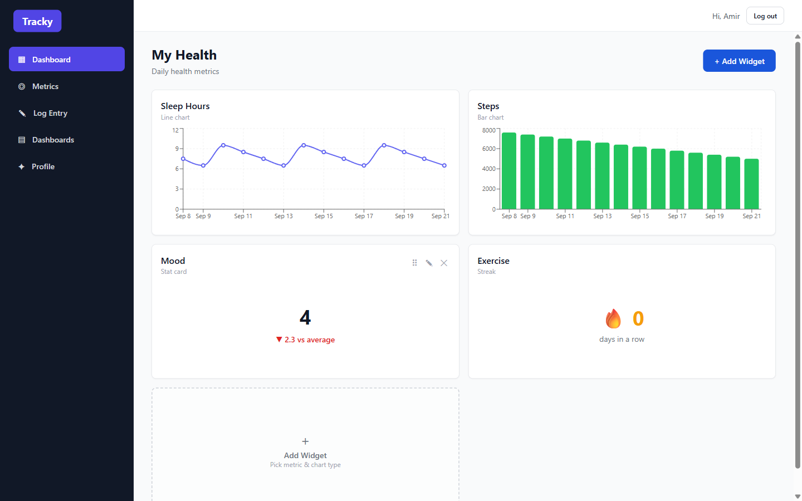
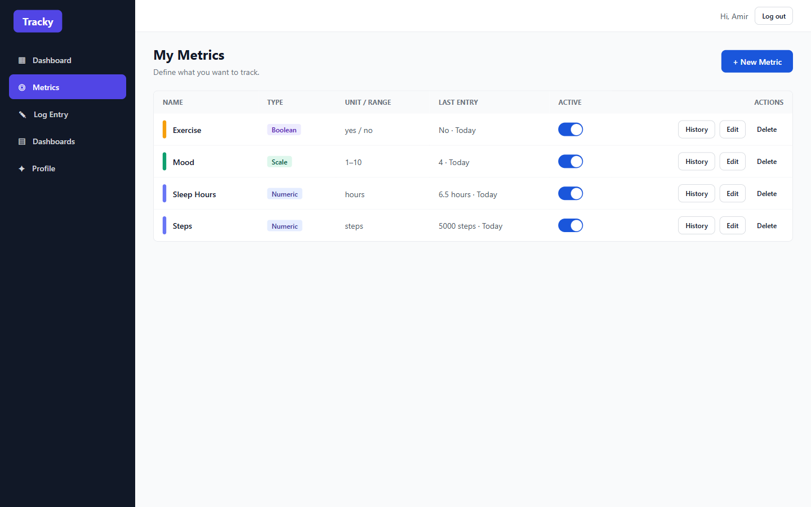
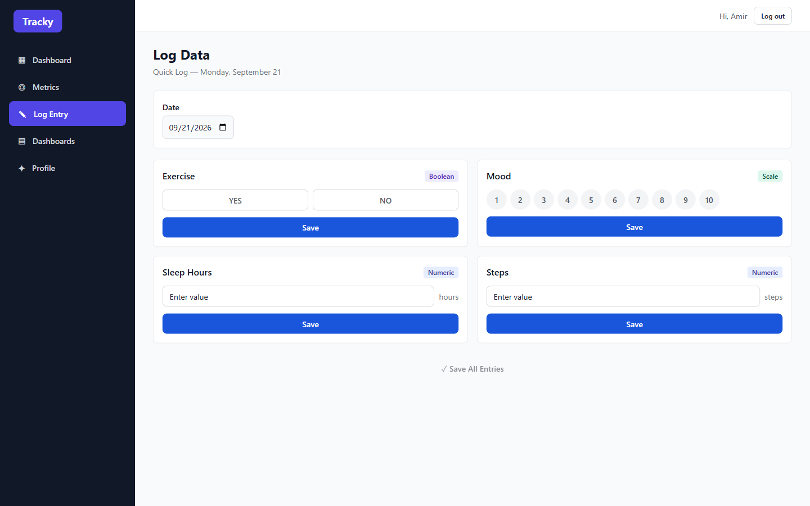
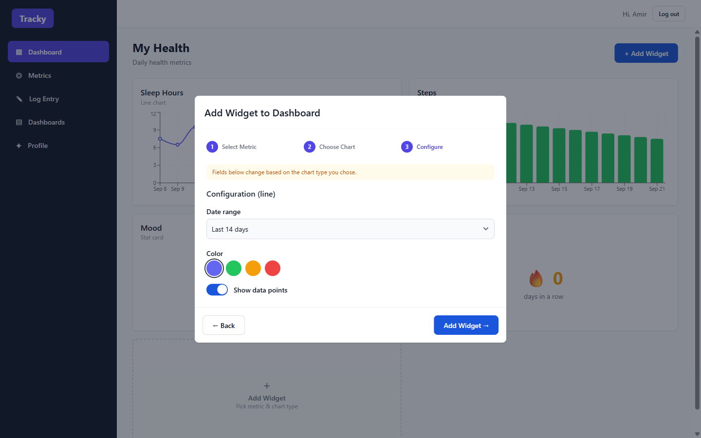
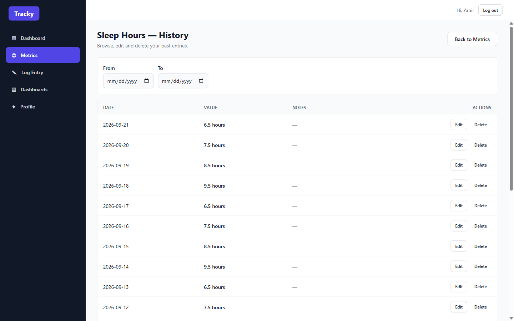
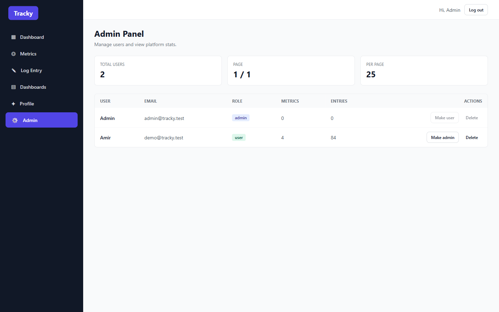
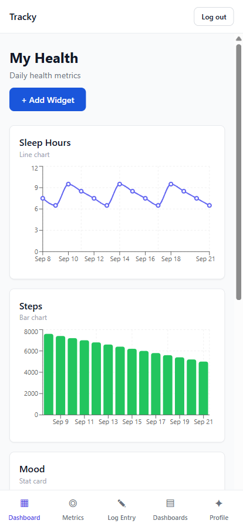
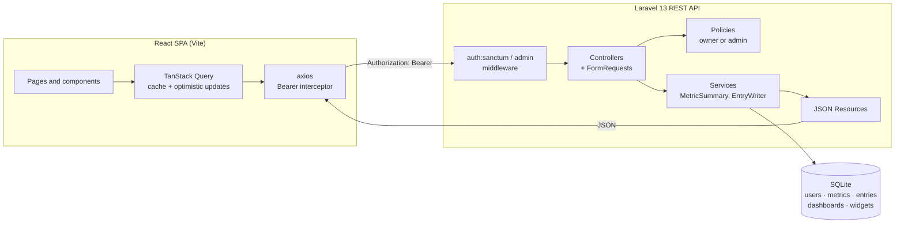
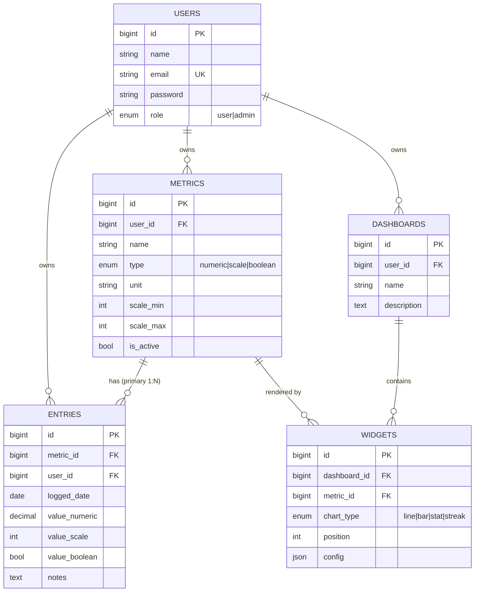

<div align="center">

# Tracky

**Track anything. See the patterns.**

A full-stack personal analytics app where you define your own metrics, log them daily,
and build dashboards out of configurable chart widgets.

[](https://github.com/zakaria17amir/Tracky/actions/workflows/ci.yml)
[](https://github.com/zakaria17amir/Tracky/actions/workflows/codeql.yml)
[](LICENSE)
[](https://laravel.com)
[](https://react.dev)
[](https://www.typescriptlang.org)
[](#testing)



</div>

---

## About

Most habit trackers decide *for* you what is worth measuring. Tracky inverts that: you define the
metrics, and the app adapts around their shape.

Declare a metric as **numeric** (sleep hours, steps), **scale** (mood 1–10), or **boolean** (did I
exercise?). That single type then drives everything downstream — which input control the logging
screen renders, which chart types the widget builder offers, and how streaks and averages are
computed. Adding a new metric type is a migration plus a renderer, not a rewrite.

Every record is owner-scoped and enforced server-side at three independent layers, so the API is
safe to expose even though the SPA is currently its only client.

> **Project status:** feature-complete and stable. Built solo as a portfolio project to practise
> REST API design, authorization modelling, and end-to-end typed contracts.

## Highlights

| | |
|---|---|
| **Type-driven metrics** | One `type` column changes the log input, the available chart types, and the summary maths. |
| **Composable dashboards** | Drop line / bar / stat / streak widgets onto named dashboards; each widget is configured independently. |
| **Drag-and-drop reordering** | Optimistic reorder with automatic rollback when the server rejects it (dnd-kit + TanStack Query). |
| **Defense in depth** | Middleware → policies → query scoping. Frontend route guards are UX only and never load-bearing. |
| **Bulk "Quick Log"** | Log every active metric for a day in a single request, upserting on `(metric_id, logged_date)`. |
| **Admin oversight** | A role-gated and deliberately **read-only** admin view — admins manage accounts, never someone's data. |
| **Fully responsive** | The desktop sidebar collapses into a mobile tab bar; tables reflow into stacked cards. |
| **Tested end to end** | 50 PHPUnit feature tests over the API contract, plus Cypress specs driving the real UI. |

## Screenshots

<table>
<tr>
<td width="50%">

<p align="center"><em>Metrics — define what you measure</em></p>
</td>
<td width="50%">

<p align="center"><em>Quick Log — inputs adapt to metric type</em></p>
</td>
</tr>
<tr>
<td width="50%">

<p align="center"><em>Widget builder — metric → chart → config</em></p>
</td>
<td width="50%">

<p align="center"><em>History — every entry, editable inline</em></p>
</td>
</tr>
<tr>
<td width="50%">

<p align="center"><em>Admin — role-gated, read-only oversight</em></p>
</td>
<td width="50%" align="center">

<p align="center"><em>Mobile — sidebar becomes a tab bar</em></p>
</td>
</tr>
</table>

## Tech stack

**Backend** — Laravel 13 · PHP 8.4+ · SQLite · Laravel Sanctum (Bearer tokens) · Laravel Breeze ·
Eloquent policies · PHPUnit · Pint

**Frontend** — React 19 · TypeScript (strict) · Vite · React Router 7 · TanStack Query ·
Tailwind CSS · Flowbite React · Recharts · dnd-kit · Cypress

**Tooling** — GitHub Actions (tests, lint, type-check, build, E2E) · CodeQL · Dependabot

## Architecture



A request crosses three gates before it reaches data:

1. **Middleware** — `auth:sanctum` on every protected route; an `admin` middleware guards `/api/admin/*`.
2. **Policies** — `view` allows owner *or* admin; `create`, `update` and `delete` allow the **owner only**.
3. **Query scoping** — every list query filters on `auth()->id()`, so foreign rows never enter a
   result set even if a policy were misconfigured.

Full reasoning and the trade-offs behind each decision are in [`docs/ARCHITECTURE.md`](docs/ARCHITECTURE.md).

## Data model



`UNIQUE(metric_id, logged_date)` enforces one entry per metric per day, which is what makes Quick
Log a safe upsert and streak counting unambiguous. Column-level detail and the reasoning behind
the split value columns are in [`docs/DATA-MODEL.md`](docs/DATA-MODEL.md).

## Quick start

**Prerequisites:** PHP 8.4+ with `pdo_sqlite`, Composer 2, Node.js 20+.

```bash
git clone https://github.com/zakaria17amir/Tracky.git
cd Tracky
```

**1. API** — first terminal:

```bash
cd backend
composer install
cp .env.example .env          # Windows: copy .env.example .env
php artisan key:generate
php artisan migrate --seed    # creates the SQLite file, tables and demo data
php artisan serve             # http://127.0.0.1:8000
```

**2. SPA** — second terminal:

```bash
cd frontend
npm install
npm run dev                   # http://localhost:5173
```

Vite proxies `/api` to port 8000, so both processes need to be running. Open
**<http://localhost:5173>** and sign in with a seeded account:

| Role  | Email               | Password   |
| ----- | ------------------- | ---------- |
| User  | `demo@tracky.test`  | `password` |
| Admin | `admin@tracky.test` | `password` |

The demo user ships with four metrics, three weeks of entries, and a populated "My Health" dashboard.

## Testing

```bash
# Backend — feature tests over the API contract, auth and ownership rules
cd backend && php artisan test

# Frontend — lint, strict type-check, production build
cd frontend && npm run lint && npm run typecheck && npm run build

# End-to-end — Cypress against the real stack (both servers must be running)
cd frontend && npm run e2e
```

The feature tests assert the things that actually matter for a multi-tenant API: that user B gets
`403` — never data — for user A's records, that `role` cannot be escalated through mass assignment,
and that admins are blocked from write routes on user-owned data. Coverage map and conventions are
in [`docs/TESTING.md`](docs/TESTING.md).

## Project structure

```
Tracky/
├── backend/                   Laravel 13 REST API
│   ├── app/
│   │   ├── Http/
│   │   │   ├── Controllers/     thin — validate, authorize, delegate
│   │   │   ├── Middleware/      EnsureUserIsAdmin
│   │   │   ├── Requests/        FormRequest validation per action
│   │   │   └── Resources/       JSON serialization contract
│   │   ├── Models/              User, Metric, Entry, Dashboard, Widget
│   │   ├── Policies/            per-model authorization
│   │   └── Services/            MetricSummary, EntryWriter
│   ├── database/                migrations, factories, seeder
│   ├── routes/                  api.php, auth.php
│   └── tests/Feature/           API test suite
├── frontend/                  React 19 + TypeScript SPA
│   ├── src/
│   │   ├── components/          layout, route guards, reusable UI
│   │   ├── context/             auth and toast providers
│   │   ├── features/            API hooks and feature components
│   │   ├── lib/                 axios client, query client, formatters
│   │   ├── pages/               route-level screens
│   │   └── types.ts             shared contract mirroring API resources
│   └── cypress/e2e/             end-to-end specs
├── docs/                      architecture, API, data model, testing, deployment
└── .github/workflows/         CI, CodeQL
```

## API

All routes are prefixed `/api` and return JSON. Authentication is a Sanctum Bearer token issued by
`POST /api/login`.

| Area | Endpoints |
| --- | --- |
| **Auth** | `POST /register` · `POST /login` · `POST /logout` · `GET\|PATCH /user` |
| **Metrics** | `GET\|POST /metrics` · `GET\|PATCH\|DELETE /metrics/{id}` · `GET /metrics/{id}/entries` · `GET /metrics/{id}/summary` |
| **Entries** | `GET\|POST /entries` · `POST /entries/bulk` · `GET\|PATCH\|DELETE /entries/{id}` |
| **Dashboards** | `GET\|POST /dashboards` · `GET\|PATCH\|DELETE /dashboards/{id}` |
| **Widgets** | `GET\|POST /dashboards/{id}/widgets` · `PATCH /dashboards/{id}/widgets/reorder` · `GET\|PATCH\|DELETE /widgets/{id}` |
| **Admin** | `GET /admin/users` · `GET\|PATCH\|DELETE /admin/users/{id}` |

Request and response shapes, validation rules, error formats and rate limits are documented in
[`docs/API.md`](docs/API.md).

## Documentation

| Document | What's inside |
| --- | --- |
| [Architecture](docs/ARCHITECTURE.md) | Layering, the three-tier authorization model, client state management, and the design decisions behind them |
| [API reference](docs/API.md) | Every endpoint with parameters, payloads, status codes and worked examples |
| [Data model](docs/DATA-MODEL.md) | Tables, relationships, indexes, constraints, and why value columns are split by type |
| [Testing](docs/TESTING.md) | What is tested at which layer, and how to run and extend the suites |
| [Deployment](docs/DEPLOYMENT.md) | Production build, environment variables, and Postgres/MySQL migration notes |
| [Contributing](CONTRIBUTING.md) | Local setup, coding standards, commit conventions |
| [Changelog](CHANGELOG.md) | Release history |
| [Security policy](SECURITY.md) | How to report a vulnerability |
| [Code of conduct](CODE_OF_CONDUCT.md) | Contributor Covenant v2.1 |

## Roadmap

- [ ] CSV / JSON export of entries
- [ ] Correlation view — plot two metrics against one another
- [ ] Reminders for metrics left unlogged
- [ ] Shareable read-only dashboard links
- [ ] Postgres as the default driver, with a Docker Compose setup

## License

Released under the [MIT License](LICENSE). © Zakaria Amir Abdullah
