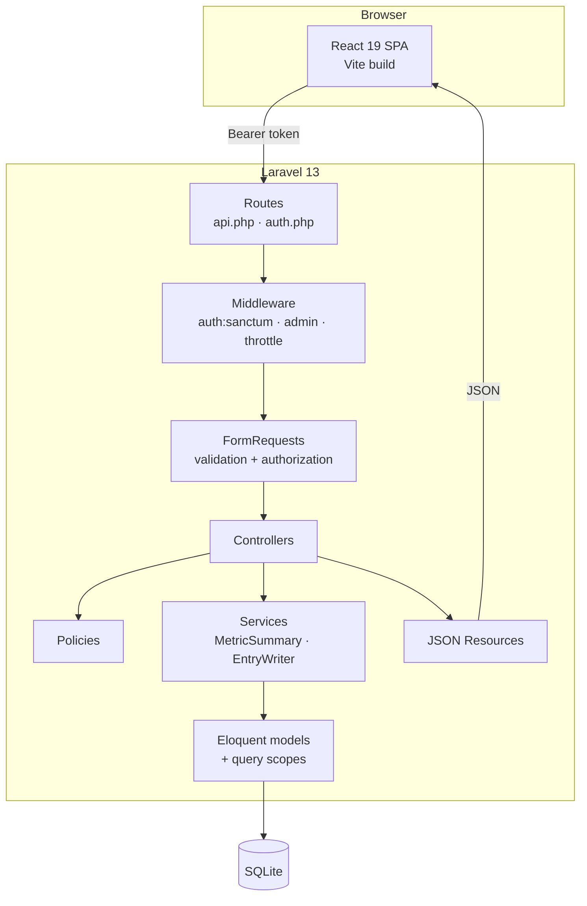
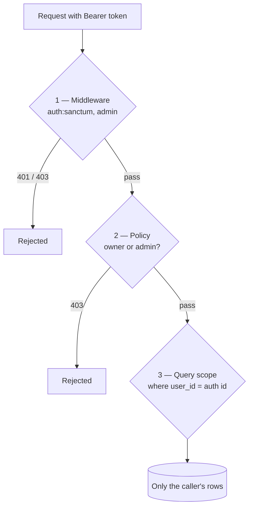

# Architecture

How Tracky is put together, and why. This document covers the shape of each layer, the
authorization model, client state management, and the trade-offs behind the decisions that were
not obvious.

## Contents

- [System overview](#system-overview)
- [Backend](#backend)
- [Authorization: three independent layers](#authorization-three-independent-layers)
- [Frontend](#frontend)
- [Key design decisions](#key-design-decisions)
- [Known limitations](#known-limitations)

## System overview

Tracky is a decoupled two-tier application: a stateless JSON API and a single-page client that
talks to it over HTTPS with a Bearer token.



Nothing is server-rendered. The API never issues a session cookie for the SPA; a Sanctum personal
access token is minted at login, stored client-side, and attached by an axios interceptor. The
consequence is that the API is fully usable by any client — a mobile app or a CLI could be added
without touching the backend.

## Backend

### Layering

Each layer has one job, and controllers stay thin on purpose.

| Layer | Responsibility | Example |
| --- | --- | --- |
| **Routes** | URL → controller mapping, middleware assignment | `routes/api.php` |
| **Middleware** | Cross-cutting gates: authentication, role, rate limiting | `EnsureUserIsAdmin` |
| **FormRequests** | Input validation and shape enforcement, per action | `StoreMetricRequest` |
| **Controllers** | Orchestration only — authorize, delegate, return a resource | `MetricController` |
| **Policies** | "May *this* user act on *this* record?" | `MetricPolicy` |
| **Services** | Logic that is too big for a controller or shared across them | `MetricSummary` |
| **Resources** | The JSON contract — what a client actually sees | `MetricResource` |
| **Models** | Relationships, casts, query scopes | `Metric` |

A controller action reads as a sentence: authorize, delegate, serialize.

```php
public function summary(Request $request, Metric $metric, MetricSummary $summary): JsonResponse
{
    $this->authorize('view', $metric);

    $threshold = (float) $request->input('threshold', 1);

    return response()->json($summary->for($metric, $threshold));
}
```

### Services

Two pieces of logic were extracted out of controllers because they are non-trivial and independently
testable:

**`MetricSummary`** computes the figures behind stat and streak widgets — current value, all-time
average, comparisons against yesterday and last week, and the consecutive-day streak. It runs a
single ordered pass over the metric's *full* history rather than over a paginated page, so a
90-day streak is counted correctly even though the chart endpoint only returns 100 rows at a time.

**`EntryWriter`** owns the write path for entries, including the bulk upsert behind Quick Log. One
place resolves "which typed value column does this metric's value belong in?", so the rule cannot
drift between the single-entry and bulk endpoints.

### Rate limiting

Auth endpoints are throttled per IP: registration at 20/min and login at 10/min. The limits are
deliberately loose rather than aggressive — they curb automated abuse without locking out users
behind shared NAT, or the E2E suite, which creates several accounts in quick succession.

## Authorization: three independent layers

This is the part of the codebase that got the most attention, because it is the part where a
mistake leaks another user's data.

The rule is simple — **a user may only ever touch their own records** — but it is enforced three
times, independently, so that no single mistake is sufficient to breach it.



### Layer 1 — Middleware

`auth:sanctum` guards every route outside register and login. `/api/admin/*` additionally passes
through `EnsureUserIsAdmin`, so a non-admin never reaches an admin controller at all.

### Layer 2 — Policies

Per-model policies answer the record-level question. The asymmetry is intentional:

```php
// Owner or admin may read.
public function view(User $user, Metric $metric): bool
{
    return $user->id === $metric->user_id || $user->isAdmin();
}

// Only the owner may modify — admins are read-only on user data.
public function update(User $user, Metric $metric): bool
{
    return $user->id === $metric->user_id;
}
```

**Admins can look, but never write.** An admin exists to support and moderate accounts, not to
silently edit someone's sleep log. Data integrity stays with the person who owns the data, which
also means an admin account compromise cannot rewrite history.

### Layer 3 — Query scoping

Every list endpoint filters by the authenticated user at the query level:

```php
Metric::query()->ownedBy($request->user()->id)
```

This is the belt to the policies' braces. Policies protect *single-record* routes; scoping protects
*collection* routes, where there is no single record to authorize. A foreign row never enters the
result set in the first place, so it cannot leak through a serialization mistake or a forgotten
`authorize()` call.

### Not an authorization layer

Frontend route guards (`ProtectedRoute`, `AdminRoute`) exist purely so users do not see a broken
screen. They are trivially bypassed with devtools, and nothing about the security model depends on
them. Every guarantee above holds against a raw `curl` against the API.

### Mass assignment

`role` is deliberately excluded from `User::$fillable`, so no registration or profile-update payload
can escalate a user to admin. It is set explicitly by the seeder, by the admin role-change endpoint,
and by the `tracky:make-admin` console command — three narrow, auditable paths. A feature test
asserts a crafted `role` field in a registration payload is ignored.

## Frontend

### Structure

```
src/
├── components/
│   ├── guards/        route gating (UX only)
│   ├── layout/        AppLayout, AuthLayout, nav definitions
│   └── ui/            reusable primitives — fields, dialogs, states
├── context/           AuthContext, ToastContext
├── features/          one module per domain: API hooks + feature components
├── lib/               axios instance, query client, formatters, error mapping
├── pages/             route-level screens
└── types.ts           shared types mirroring the API resources
```

Feature modules (`features/metrics.ts`, `features/entries.ts`, …) own the query keys, fetchers and
mutations for a domain. A page composes hooks; it never calls axios directly. That keeps cache
invalidation decisions next to the code that causes them instead of scattered across screens.

### Server state vs. client state

The distinction drives the whole data layer:

- **Server state** — metrics, entries, dashboards, widgets — lives in **TanStack Query**. It is
  cached, deduplicated, invalidated on mutation, and never copied into component state.
- **Client state** — the current session, toasts, modal open/closed, form drafts — lives in React
  context or local state.

Because server data is never mirrored into `useState`, there is no class of bug where a list and a
detail view disagree after an edit.

### Optimistic updates

Widget reordering is optimistic, which is where drag-and-drop earns its keep:

1. `onMutate` cancels in-flight queries for the dashboard and snapshots the current widget order.
2. The cache is written to the new order immediately, so the card stays where it was dropped.
3. If the request fails, `onError` restores the snapshot and a toast explains why.
4. `onSettled` invalidates, reconciling with whatever the server actually stored.

The user sees an instant reorder, and a failure is visibly corrected rather than silently lost.

### The type contract

`src/types.ts` mirrors the Laravel JSON Resources field for field — `Metric`, `Entry`, `Widget`,
`Dashboard`, plus the `Paginated<T>` envelope. A backend resource change that is not mirrored here
is caught by `tsc` at build time rather than as `undefined` at runtime.

Metric and chart types are unions, not strings:

```ts
export type MetricType = "numeric" | "scale" | "boolean";
export type ChartType = "line" | "bar" | "stat" | "streak";
```

Which is what makes the type-driven UI safe: a `switch` over a metric type that misses a case is a
compile error, so adding a fourth metric type surfaces every place that needs updating.

### Error handling

`lib/errors.ts` maps API failures to human sentences in one place. Laravel's 422 validation shape
(`{ message, errors: { field: [msg] } }`) is unwrapped into per-field messages; 401 clears the
session and redirects to login; 403 and 500 get their own copy. An `ErrorBoundary` catches render
errors so a bad chart payload degrades one widget rather than blanking the app.

## Key design decisions

### Separate value columns instead of one polymorphic column

`entries` stores `value_numeric`, `value_scale` and `value_boolean` as three nullable columns rather
than a single `value` string.

*Why:* the database keeps its types. `AVG(value_numeric)` is a real average, not a cast over text
that dies on the first bad row; range queries use an index; a scale value cannot be stored as
`"seven"`. The cost is a wider, sparser table and a `resolvedValue()` helper in `EntryResource` that
collapses the three columns into a single `value` field for clients. That cost is paid once, in one
method, and correctness is enforced by the schema — a good trade.

### A denormalized `user_id` on `entries`

`entries.user_id` duplicates what could be derived through `metric.user_id`.

*Why:* owner scoping is the single most frequent filter in the application, and it happens on every
list request. Without it, every scope check needs a join, and the safest possible query — "rows
belonging to this user" — becomes the most expensive one. The duplication is safe because entries
are only ever written through `EntryWriter`, which sets both columns, and because a metric never
changes owner. Cascade deletes on both foreign keys keep the two in agreement.

### `UNIQUE(metric_id, logged_date)`

One entry per metric per day, enforced by the database rather than by application code.

*Why:* it makes Quick Log an upsert instead of a read-then-branch, removes a race between two
concurrent submissions, and makes "consecutive days" unambiguous — there is exactly one row per day,
so a streak is a walk backwards through dates with no deduplication step.

### Widget config as JSON

Per-widget settings (`range_days`, `color`, `grouping`, `threshold_value`, …) live in a single
`config` JSON column instead of dedicated columns.

*Why:* the fields are chart-type specific and expected to change. A line chart wants `show_points`;
a streak wants `threshold_type`. Modelling that relationally means either a sparse table of mostly
null columns or an EAV table, and both are worse than JSON for data that is only ever read as a
whole, by one widget, and never queried across rows. The trade-off is that the database cannot
validate it — so `WidgetConfig` in TypeScript and the FormRequest rules in PHP carry that weight.

### SQLite as the default

*Why:* clone and run. `php artisan migrate` creates the file; there is no service to install, no
credentials to configure, and no Docker prerequisite. Because everything goes through Eloquent and
migrations with no raw vendor-specific SQL, moving to Postgres or MySQL is a `.env` change plus
`php artisan migrate` — see [DEPLOYMENT.md](DEPLOYMENT.md).

### Bearer tokens over cookie sessions

Sanctum supports both. Tracky uses personal access tokens.

*Why:* the SPA and API are independently deployable and may live on different origins, which makes
`SameSite` cookies and CSRF cookie priming an awkward fit. Tokens keep the API origin-agnostic and
open the door to non-browser clients. The trade-off is that a token lives in browser storage rather
than an `HttpOnly` cookie, so it is reachable by script — meaning XSS discipline (React's default
escaping, no `dangerouslySetInnerHTML`) is doing real security work, and tokens are revoked
server-side on logout.

## Known limitations

Honest notes on where this stops, and what would change first at scale.

- **No refresh-token rotation.** Tokens are long-lived until logout. Short-lived access tokens with
  refresh would be the next hardening step.
- **Chart data is fetched per widget.** A dashboard with many widgets issues one request each. A
  batched endpoint would help once dashboards grow past a handful of widgets.
- **No caching layer.** `MetricSummary` recomputes on every request. It is a single indexed scan over
  one user's entries, which is fine at personal scale and would want memoization at a larger one.
- **SQLite serializes writes.** Correct for single-user workloads, not for concurrent multi-tenant
  traffic. Postgres is the answer, and the migration path is already clear.
- **No soft deletes.** Deleting a metric cascades its entries irreversibly. A recycle bin would be a
  kindness.
