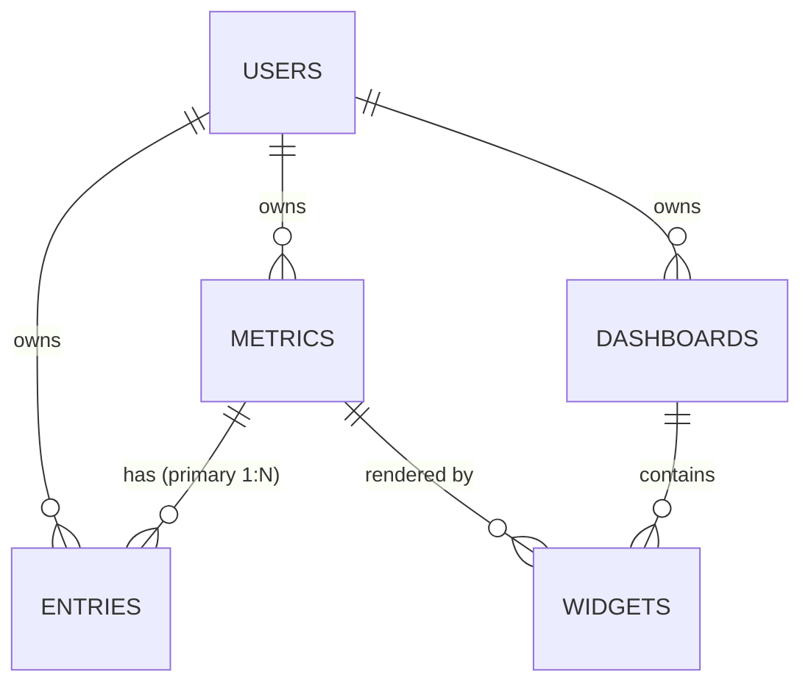

# Data model

Five tables, one owner. Every row in the system traces back to a user, and the schema is built so
that the database — not application code — is what guarantees it.

## Entity relationships

| Relationship | Cardinality | Notes |
| --- | --- | --- |
| `users` → `metrics` | 1:N | Cascade delete |
| `metrics` → `entries` | 1:N | **The primary working relationship** — cascade delete |
| `users` → `entries` | 1:N | Denormalized owner reference — cascade delete |
| `users` → `dashboards` | 1:N | Cascade delete |
| `dashboards` → `widgets` | 1:N | Cascade delete |
| `metrics` → `widgets` | 1:N | Cascade delete — removing a metric removes charts of it |

Deleting a user removes everything they own, in one cascade, with no orphan rows left behind.

## Tables

### `users`

Authentication, profile, and the root of every ownership chain.

| Column | Type | Notes |
| --- | --- | --- |
| `id` | bigint PK | |
| `name` | string | |
| `email` | string | Unique |
| `email_verified_at` | timestamp | Nullable; cleared when the email changes |
| `password` | string | Bcrypt, cast `hashed` |
| `role` | enum | `user` \| `admin`, default `user` |
| `remember_token` | string | Nullable |
| `created_at` / `updated_at` | timestamps | |

`role` is **excluded from `$fillable`**. No registration or profile payload can set it; it is
written only by the seeder, the admin role endpoint, and the `tracky:make-admin` command. A feature
test asserts that a crafted `role` field in a registration request is ignored.

### `metrics`

A user-defined thing to measure. The `type` column is the pivot the whole application turns on.

| Column | Type | Notes |
| --- | --- | --- |
| `id` | bigint PK | |
| `user_id` | bigint FK → `users` | Cascade delete |
| `name` | string(100) | |
| `description` | text | Nullable |
| `type` | enum | `numeric` \| `scale` \| `boolean` — immutable after creation |
| `unit` | string(30) | Nullable — "hours", "steps", "kg" |
| `scale_min` | integer | Nullable, default 1 — used by `scale` |
| `scale_max` | integer | Nullable, default 10 — used by `scale` |
| `is_active` | boolean | Default true — inactive metrics drop off Quick Log |
| `created_at` / `updated_at` | timestamps | |

**Index:** `(user_id, is_active)` — matches the most common query, "this user's active metrics", which
Quick Log runs on every visit.

`type` is immutable because changing it would leave existing values stranded in the wrong column.
The API simply does not accept it on update.

`is_active` is a soft retirement: an inactive metric keeps its history and charts but stops appearing
in the logging screen. That is better than deletion for something you tracked for a year and stopped.

### `entries`

One logged value, for one metric, on one day. The highest-volume table, and the one most
carefully indexed.

| Column | Type | Notes |
| --- | --- | --- |
| `id` | bigint PK | |
| `metric_id` | bigint FK → `metrics` | Cascade delete |
| `user_id` | bigint FK → `users` | Denormalized owner — cascade delete |
| `logged_date` | date | Date only, no time |
| `value_numeric` | decimal(10,2) | Nullable — set when the metric is `numeric` |
| `value_scale` | integer | Nullable — set when the metric is `scale` |
| `value_boolean` | boolean | Nullable — set when the metric is `boolean` |
| `notes` | text | Nullable, max 1000 chars |
| `created_at` / `updated_at` | timestamps | |

**Constraints and indexes**

| | Purpose |
| --- | --- |
| `UNIQUE(metric_id, logged_date)` | One entry per metric per day |
| `INDEX(user_id, logged_date)` | Owner-scoped history and list queries |
| The unique index above | Also serves chart range queries on `(metric_id, logged_date)` |

Exactly one of the three value columns is non-null for any row; which one is determined by the
parent metric's `type` and enforced in `EntryWriter`, the single write path.

### `dashboards`

A named collection of widgets.

| Column | Type | Notes |
| --- | --- | --- |
| `id` | bigint PK | |
| `user_id` | bigint FK → `users` | Cascade delete |
| `name` | string(100) | |
| `description` | text | Nullable |
| `created_at` / `updated_at` | timestamps | |

### `widgets`

One chart, bound to one metric, placed on one dashboard.

| Column | Type | Notes |
| --- | --- | --- |
| `id` | bigint PK | |
| `dashboard_id` | bigint FK → `dashboards` | Cascade delete |
| `metric_id` | bigint FK → `metrics` | Cascade delete |
| `chart_type` | enum | `line` \| `bar` \| `stat` \| `streak` |
| `position` | integer | Default 0 — render order within the dashboard |
| `config` | json | Default `{}` — chart-type specific settings |
| `created_at` / `updated_at` | timestamps | |

**Index:** `(dashboard_id, position)` — the exact shape of the "render this dashboard" query.

A widget has no `user_id`. Ownership is reached through `dashboard_id`, and the policy walks that
relationship. Two hops is cheap here because a widget is never queried outside the context of its
dashboard.

## Design decisions

### Three value columns, not one

The obvious alternative is a single `value` column storing everything as text or JSON. Splitting by
type costs a wider, sparser table and a small resolver in the API resource. It buys:

- **Real aggregates.** `AVG(value_numeric)` is arithmetic, not a cast over text that fails on the
  first malformed row.
- **Usable indexes.** Range filters on numeric values can use an index; a text column cannot serve
  them meaningfully.
- **Database-level type safety.** A scale metric cannot end up storing `"seven"`.

Clients never see the split — `EntryResource` collapses it into a single `value` field. The
complexity is paid once, in one method.

### `entries.user_id` is denormalized on purpose

`user_id` is derivable through `metric.user_id`, so storing it is duplication. It is there because
owner scoping is the single most frequent filter in the application and runs on every list request.
Without the column, the safest possible query — "rows belonging to this user" — becomes the most
expensive one, requiring a join every time.

The duplication is safe because entries are written through exactly one service (`EntryWriter`, via
`EntryController`) which always sets both, and because a metric never changes owner. Cascade deletes
on both foreign keys keep the two consistent.

### `UNIQUE(metric_id, logged_date)`

The one-entry-per-day rule is enforced by the database rather than by application checks, which:

- makes Quick Log a true upsert instead of read-then-branch,
- removes the race between two concurrent submissions for the same day,
- makes streaks unambiguous — one row per day means a streak is a backwards walk through dates with
  no deduplication step.

### `config` as JSON

Widget settings are chart-type specific and expected to evolve. Modelling them relationally means
either a wide table of mostly-null columns or an EAV table. Since `config` is only ever read as a
whole, by one widget, and never queried across rows, JSON is the right shape.

The trade-off is that the database cannot validate it. That weight is carried by the `WidgetConfig`
TypeScript interface on the client and the FormRequest rules on the server.

## Sample data

`php artisan migrate --seed` creates:

| | |
| --- | --- |
| **Admin** | `admin@tracky.test` / `password`, role `admin` |
| **Demo user** | `demo@tracky.test` / `password`, role `user` |
| **Metrics** | Sleep Hours (numeric, hours), Mood (scale 1–10), Exercise (boolean), Steps (numeric) |
| **Entries** | 21 days of history across all four metrics |
| **Dashboard** | "My Health", with line, bar, stat and streak widgets |

The seeder is idempotent — it upserts the two accounts and skips sample data when the demo user
already has metrics, so re-running it will not duplicate anything.

## Changing database engine

Nothing in the schema is SQLite-specific: no raw SQL, no vendor functions, all Eloquent and
migrations. Moving to Postgres or MySQL is a `.env` change plus `php artisan migrate` — see
[DEPLOYMENT.md](DEPLOYMENT.md).

One note when migrating: `enum` columns are emitted as native enums on MySQL and as check constraints
on Postgres. Adding a value to `metrics.type` or `widgets.chart_type` therefore needs a migration on
those engines, where SQLite is permissive.
